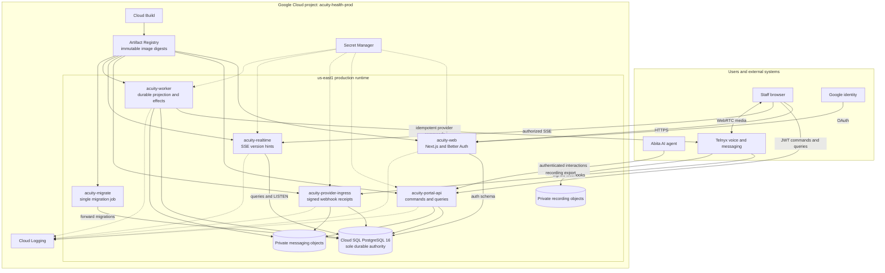
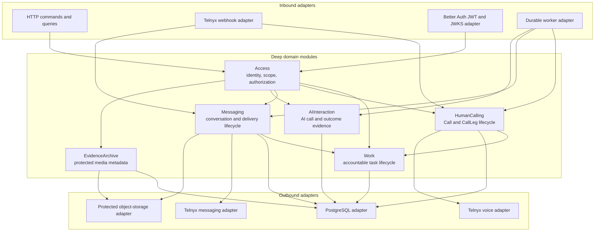
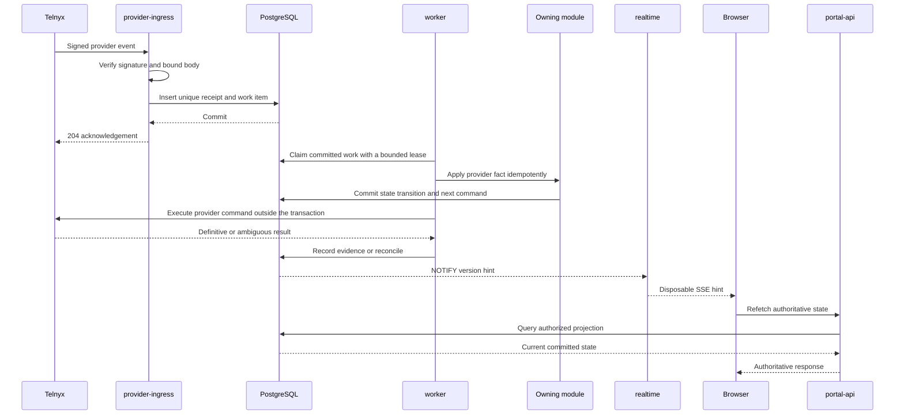
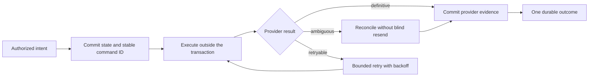
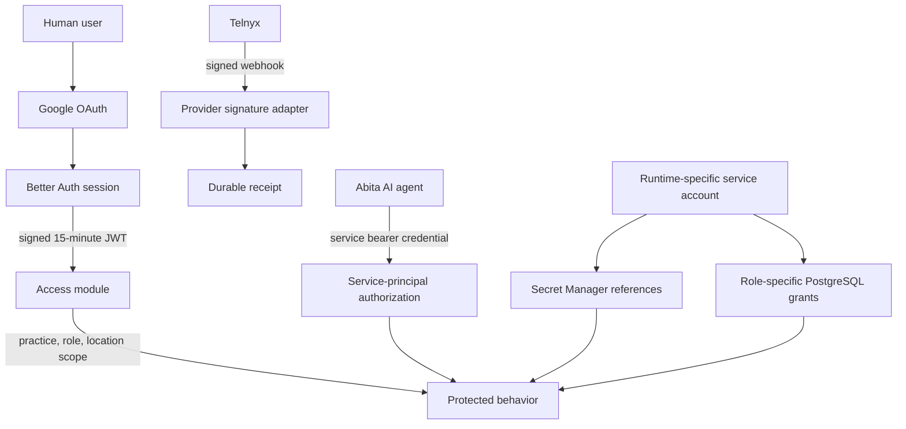
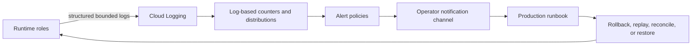

# Acuity Product architecture

Acuity Product is a call-center operating workspace built as a Next.js web
application, one Go modular monolith, and PostgreSQL. The backend is deployed as
separate Cloud Run runtime roles so request traffic, provider ingress, realtime
streams, durable work, and schema migration can fail and scale independently
without splitting domain ownership across microservices.

Production readiness is an evidence claim, not a topology label. This document
uses three evidence levels:

- **Live** — observed in the `acuity-health-prod` Google Cloud project on
  2026-08-09.
- **Enforced** — checked by version-controlled code, tests, or deployment
  automation.
- **Gate** — required by the production runbook but not proven by configuration
  alone.

The detailed behavioral architecture lives in
[`docs/architecture/overview.md`](docs/architecture/overview.md). The checked
compute and recovery values live in
[`deploy/production-runtime-contract.json`](deploy/production-runtime-contract.json).

## Architecture at a glance



The architecture deliberately combines one domain implementation with multiple
runtime roles. This preserves locality in the codebase while isolating unlike
production workloads.

## Live Google Cloud compute

All request roles use request-based billing. The worker uses instance-based
billing so durable recovery does not depend on an inbound request. Every role
has its own Google service account and its own least-privilege database
credential.

| Runtime | Kind | Workload | CPU / memory | Concurrency | Scale |
| --- | --- | --- | --- | ---: | ---: |
| `acuity-web` | Cloud Run service | Next.js, Better Auth | 1 vCPU / 512 MiB | 40 | 1–2 |
| `acuity-portal-api` | Cloud Run service | authenticated commands and queries | 1 vCPU / 512 MiB | 20 | 1–3 |
| `acuity-provider-ingress` | Cloud Run service | verify and durably receipt webhooks | 1 vCPU / 512 MiB | 20 | 1–2 |
| `acuity-realtime` | Cloud Run service | authorized SSE hints | 1 vCPU / 512 MiB | 50 | 1–2 |
| `acuity-worker` | Cloud Run worker pool | projection, retry, reconciliation | 1 vCPU / 512 MiB | n/a | 1 fixed |
| `acuity-migrate` | Cloud Run job | reviewed schema and grant migration | 1 vCPU / 512 MiB | n/a | 1 task, 0 retries |

The database is Cloud SQL for PostgreSQL 16 Enterprise in `us-east1`, with 2
vCPU, 8 GiB memory, 50 GiB SSD, automatic storage growth, deletion protection,
daily backups, seven retained backups, and seven days of point-in-time recovery
logs. It is intentionally zonal: a database or zone outage does **not** have
automatic failover.

The checked connection reservation is explicit:

```text
maximum request-role demand          11
overlapping worker revisions          2
single migration task                 1
autoscaler overshoot headroom         5
operator and recovery headroom        3
                                      --
required usable connections          22
```

Each request-role instance has a one-connection application pool; realtime
also owns one dedicated PostgreSQL `LISTEN` connection. The small pools make
database pressure bounded and visible instead of allowing autoscaling to
silently exhaust PostgreSQL.

## Deep modules and explicit seams

A module earns its place by hiding meaningful behavior behind one small
interface. HTTP handlers, SQL, authentication, Telnyx, and object storage are
adapters at explicit seams; they do not own domain state.



The important seams have two justified adapters: a production adapter and a
deterministic test adapter. PostgreSQL is tested as real, local-substitutable
infrastructure so transaction, lock, uniqueness, and retry behavior remain
inside the module implementation.

## One durable event path

Provider acknowledgements never wait on business projection or another remote
effect. A webhook receives success only after its unique receipt commits.
Replays, reordering, runtime loss, and ambiguous provider outcomes converge
through durable state.



The browser never becomes an authority for call state, message delivery, or
appointment outcomes. Provider evidence and committed receipts do.

## Command and recovery model



This pattern keeps external latency out of database transactions, prevents
duplicate side effects, and makes failure visible and recoverable. Ambiguous
mutations are reconciled; they are not automatically repeated.

## Auth and trust paths



Human identity, service identity, provider authenticity, tenant scope, and
runtime identity are separate checks. Client-supplied IDs are requested
context, never authorization proof. Private object buckets enforce uniform
bucket-level access and public-access prevention.

## Tested release pipeline

Only a tested `main` commit can enter the production release. GitHub Actions
uses Workload Identity Federation, so the pipeline does not store a long-lived
Google Cloud key.

```mermaid
flowchart LR
    Change["Pull request"] --> CI{"Required CI"}
    CI --> Backend["Go and PostgreSQL tests"]
    CI --> WebTests["Lint, types, unit, build"]
    CI --> Contracts["Generated and auth schema checks"]
    CI --> Browser["Playwright journey"]
    Backend --> Main["Merge to main"]
    WebTests --> Main
    Contracts --> Main
    Browser --> Main
    Main --> OIDC["GitHub OIDC and Workload Identity"]
    OIDC --> Build["Cloud Build"]
    Build --> Images["Build and push immutable digests"]
    Images --> Migration["Run one forward migration job"]
    Migration --> Stage["Stage backend revisions with no traffic"]
    Stage --> Verify["Verify digest, liveness, readiness"]
    Verify --> PromoteWorker["Promote worker revision"]
    PromoteWorker --> PromoteAPI["Promote request roles to 100 percent"]
    PromoteAPI --> StageWeb["Stage and verify web revision"]
    StageWeb --> Smoke["Smoke sign-in, session, and readiness"]
    Smoke --> Released["Release complete"]

    Verify -.->|"failure"| Rollback["Restore captured revisions"]
    PromoteAPI -.->|"failure"| Rollback
    Smoke -.->|"failure"| Rollback
```



Application rollback moves traffic and worker allocation to captured compatible
revisions. It never destructively reverses a migration. Schema changes remain
forward-compatible across the rollout window.

## Observable operations

Runtime modules emit a bounded, PHI-safe metric contract. The intended Google
Cloud operations loop is:



The metric and alert definitions are checked into
[`deploy/observability`](deploy/observability/README.md), but the live project
inventory on 2026-08-09 contained no matching `acuity_call_center` log metrics
or alert policies. That operations loop is therefore an explicit launch gate,
not a completed live control.

## Production evidence snapshot

Read-only Google Cloud inspection on 2026-08-09 established:

- all four Cloud Run request services and the worker pool were `Ready`;
- all five active runtimes had 100% allocation to release
  `4e5aa997-7086-410a-8db0-415f989f404f`;
- the successful Cloud Build release was built from repository commit
  `618499027850101dad9267d8c0abc6b58c5a9cb3`;
- backend and web runtimes referenced immutable Artifact Registry digests;
- `acuity-production` was `RUNNABLE` in `us-east1` with the checked PostgreSQL,
  backup, PITR, storage, and deletion-protection configuration; and
- the regional messaging and recording buckets enforced uniform bucket-level
  access, public-access prevention, and seven-day soft deletion.

This proves deployed compute health and release alignment. It does not, by
itself, prove live carrier behavior, user latency, restore performance, or alert
delivery.

## Readiness ledger

| Control | Evidence | Status |
| --- | --- | --- |
| Workload isolation | four request roles, one fixed worker, one migration job | **Live** |
| Immutable release provenance | successful commit-tagged Cloud Build; digest-pinned active revisions | **Live** |
| Warm floor and bounded scaling | runtime min/max, concurrency, and pool limits match the checked contract | **Live** |
| Durable authority | PostgreSQL-backed receipts, commands, leases, idempotency, and interface-level tests | **Enforced** |
| Least-privilege runtime identity | distinct service accounts, Secret Manager references, database grants | **Live + enforced** |
| Recovery configuration | daily backups, seven-day PITR, deletion protection, soft-deleted objects | **Live** |
| Release safety | required CI, no-traffic staging, probes, smoke checks, captured-revision rollback | **Enforced** |
| Database availability | single-zone by explicit cost/availability decision | **Accepted limitation** |
| Restore performance | timed backup/PITR restore rehearsal and validation | **Gate** |
| Live capacity | Cloud Run/Cloud SQL load, pool saturation, autoscaler overshoot, Florida latency | **Gate** |
| Provider acceptance | live Telnyx delivery, retry, reconciliation, WebRTC, and recording proof | **Gate** |
| Alert delivery | apply metrics/policies and trigger one reversible incident per policy | **Gate** |
| Shared object behavior | cross-runtime visibility, IAM, retention, and signed-expiry proof | **Gate** |

The result is a modern, production-oriented architecture with strong correctness
and deployment controls. The remaining gates are deliberately visible because
production readiness depends on observed recovery and end-to-end behavior, not
the number of managed products in a diagram.

## Architecture references

- [Behavioral architecture and invariants](docs/architecture/overview.md)
- [Call-center observability contract](docs/architecture/call-center-observability.md)
- [Production runtime capacity contract](deploy/production-runtime-contract.md)
- [Production release and recovery runbook](deploy/production-runbook.md)
- [Product and technical specification](docs/acuity-portal-product-technical-spec.md)
- [Google Cloud call-center controls](docs/research/google-cloud-call-center-controls.md)
