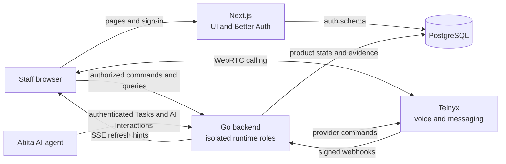

# Acuity Portal

Acuity Portal is the shared workspace where medical-practice teams turn patient
communication into accountable work. Staff can see what needs attention, who
owns it, what has already happened, and whether the need reached a real outcome.

The Abita AI agent owns the automated patient conversation. This repository
owns the staff workspace, human calling and messaging, Tasks, and the evidence
that connects them.

[Product](#what-the-workspace-does) · [Architecture](#architecture) ·
[Local development](#local-development) · [Verification](#verification) ·
[Operations](#releases-and-operations)

## What the workspace does

- **Tasks:** capture a patient need, its next action, assignment, priority, and
  completion. Keep the Activity timeline when work is completed or reopened.
- **Calling:** receive AI-to-human transfers, make outbound calls, transfer
  between Staff, and record post-call outcomes. Keep voicemail and authorized
  recording playback beside the work.
- **Messaging:** send and receive Location-scoped SMS/MMS, track delivery and
  attachments, and create follow-up Tasks when staff identifies work to do.
- **AI evidence:** preserve AI Interactions, transcripts, and receipt-backed
  appointment outcomes without treating an automated claim as proof of success.

A resolved Interaction should not create unnecessary work. An unresolved need
should remain visible until it reaches an accountable outcome. Inbound messages
are communication evidence; they do not automatically become Tasks.

A **Practice** is the customer tenant and security boundary; a **Location** is
an office within it. Google sign-in establishes human identity, and the backend
enforces Memberships and Location Scope. Practice Admins and Acuity-wide
Platform Operators are distinct roles. Contact Context and phone-number history
help staff act; neither is verified patient identity or a medical record.

See [VISION.md](VISION.md) for the product principles and
[CONTEXT.md](CONTEXT.md) for the shared vocabulary.

## Architecture

The system has three foundations: a **Next.js frontend**, a **Go modular
monolith**, and **PostgreSQL as the durable source of truth**. Telnyx supplies
voice and messaging. Better Auth supplies Google authentication and sessions;
the Go `Access` module owns product authorization.



### One backend, five runtime roles

The same Go binary and backend image run in five modes, selected by
`ACUITY_RUNTIME_ROLE`. These are workload boundaries, not separate
microservices: they share domain code and committed PostgreSQL state.

| Role | Responsibility | Production resource |
| --- | --- | --- |
| `portal-api` | Authenticated staff and AI commands and queries | Cloud Run service |
| `provider-ingress` | Verify provider webhooks and commit durable receipts | Cloud Run service |
| `realtime` | Send authorized server-sent event (SSE) version hints | Cloud Run service |
| `worker` | Project receipts, execute durable commands, retry, and reconcile | Cloud Run worker pool |
| `migrate` | Apply reviewed schema migrations, grants, and provisioning | Cloud Run job |

The frontend runs as a separate Cloud Run service. Production uses Cloud SQL
PostgreSQL 16 and private storage for messaging attachments. Telnyx owns call
recording and voicemail audio; the backend checks access and streams it without
exposing provider credentials or raw download URLs.

### Code ownership

Business rules live in their owning module under `backend/internal/`.

| Module | Package | Owns |
| --- | --- | --- |
| Access | [`access/`](backend/internal/access) | Identity, Access Grants, Memberships, scopes, and authorization |
| Work | [`work/`](backend/internal/work) | Task lifecycle, assignment, priority, and Activity |
| HumanCalling | [`humancalling/`](backend/internal/humancalling) | Calls, CallLegs, softphone readiness, transfers, voicemail, and recordings |
| Messaging | [`messaging/`](backend/internal/messaging) | Conversations, send intent, delivery evidence, and attachments |
| AIInteraction | [`interaction/`](backend/internal/interaction) | AI call lifecycle, transcripts, appointment evidence, and analytics |

The [`workspace/`](backend/internal/workspace) query layer combines authorized
cross-domain views; it does not own domain writes. HTTP, authentication,
provider, storage, and worker adapters connect to the owning modules.

The browser/backend contract is [`api/openapi.yaml`](api/openapi.yaml).
Go bindings and the TypeScript client are generated from it, not edited by hand.

### How state becomes trustworthy

1. **Authorize the action.** Resolve the real actor and their Practice and
   Location access. Client-supplied IDs are requested context, not permission.
2. **Commit intent before effects.** Save product state and durable provider
   commands before contacting an external provider. Provider I/O stays outside
   database transactions.
3. **Commit evidence before acknowledging it.** A valid webhook receives a
   success response only after its unique receipt is durable. Workers project
   receipts and recover interrupted work with bounded retries and reconciliation.
4. **Refresh from committed state.** SSE carries version hints, not authoritative
   product state. The browser refetches authorized views; calling also reconciles
   through polling. Neither browser intent nor a successful provider request
   proves that a call connected or a message was delivered.

Detailed boundaries, lifecycles, and invariants live in the
[architecture guide](docs/architecture/overview.md).

## Local development

Run the commands below from the repository root. The frontend package lives in
`web/`; there is no root JavaScript package.

### Prerequisites

- Go 1.26 and Node.js 24. Exact CI versions are pinned in
  [the verification workflow](.github/workflows/verify.yml).
- pnpm 10.34.5, matching [`web/package.json`](web/package.json).
- A running local PostgreSQL 16 server, the `psql` and `createdb` tools, and
  `curl`. Use a disposable local database cluster whose user can create roles
  and reset schemas for integration tests.

Install dependencies:

```sh
go mod download
pnpm --dir web install --frozen-lockfile
```

### Prepare disposable databases

**Tests reset schemas. Never point these commands at production or a database
containing data you need.** Backend tests require a name ending in `_test`;
browser tests require `_e2e`.

These examples assume local PostgreSQL accepts your current OS user on
`127.0.0.1`. Adjust the connection settings for your local installation. Create
the databases once, then set the URLs in the shell where you run the tests.

```sh
createdb --host=127.0.0.1 acuity_test
createdb --host=127.0.0.1 acuity_e2e

export TEST_DATABASE_URL='postgres://127.0.0.1/acuity_test?sslmode=disable'
export E2E_DATABASE_URL='postgres://127.0.0.1/acuity_e2e?sslmode=disable'
```

### Run the full-stack browser journey

The repository's self-contained local startup path is the
[end-to-end harness](scripts/run-e2e.sh):

```sh
pnpm --dir web exec playwright install chromium
./scripts/run-e2e.sh
```

It resets the E2E schemas, applies migrations and
[synthetic provisioning](config/development-provisioning.json), starts the
frontend and backend roles, runs Chromium tests, and stops the processes when
finished. Ports `13000`, `18080`, `18081`, `18082`, and `19000` must be free.
On Linux, browser system dependencies may also be needed; CI installs Chromium
with `--with-deps`.

The harness uses test sessions and a local Telnyx fixture. It does not require
live Google or Telnyx credentials, and it does not prove real sign-in, carrier
delivery, or live-call media behavior. It is a test runner, not a persistent
development server.

### Interactive development

For a persistent local environment, run `migrate` once, then start `portal-api`,
`provider-ingress`, `realtime`, and `worker` as separate processes. There is no
single persistent-stack launcher; use the role configuration in
[`scripts/run-e2e.sh`](scripts/run-e2e.sh) as the synthetic reference and
[`backend/internal/app/config.go`](backend/internal/app/config.go) for the
required environment variables. The Go process reads exported environment
variables, not `.env` files.

Configure the frontend using [web/README.md](web/README.md), then start it with:

```sh
pnpm --dir web dev
```

The dev server alone does not provide the authenticated workspace. Interactive
Google sign-in needs valid OAuth configuration and a preauthorized Access
Grant or Platform Operator binding. Test-session helpers are test-only. Never
commit secrets or copy production credentials into synthetic fixtures.

## Verification

Start with the check closest to your change. These are the main local commands
used by [CI](.github/workflows/ci.yml) through its
[reusable verification workflow](.github/workflows/verify.yml).

### Backend

With `TEST_DATABASE_URL` set to the disposable `_test` database:

```sh
go test -p 1 ./backend/... ./deploy -count=1
```

Keep database-backed packages serial: they share and reset schemas. Without
`TEST_DATABASE_URL`, integration tests may skip; a green exit is not proof that
database behavior passed. Pull-request CI shards packages across isolated
databases; main and release verification run the full serial suite.

### Frontend

```sh
pnpm --dir web lint
pnpm --dir web typecheck
pnpm --dir web test:unit
NEXT_PUBLIC_PORTAL_API_URL=http://127.0.0.1:18080 \
NEXT_PUBLIC_REALTIME_URL=http://127.0.0.1:18081 \
  pnpm --dir web build
```

Use the full-stack browser journey above for changes to user flows.

### Generated contracts

After changing `api/openapi.yaml`, regenerate both clients and review the diff:

```sh
go generate ./backend/internal/api
pnpm --dir web api:generate
```

CI also checks dependency vulnerabilities and Better Auth schema drift. For
auth schema changes, [`scripts/check-auth-schema.sh`](scripts/check-auth-schema.sh)
requires `AUTH_SCHEMA_CHECK_DATABASE_URL` pointing to a separate disposable
database ending in `_schema_check`; it also resets schemas.

## Releases and operations

Ordinary merges to `main` do not deploy. After successful main CI,
[Release Please](.github/workflows/release.yml) creates or updates the release
PR. Publishing a release triggers verification of the exact released commit
before the gated production deployment.

The deployment builds immutable backend and web images, runs the migration job,
stages and checks revisions, then promotes the worker, backend services, and
frontend. Rollback restores compatible application revisions; it does not
reverse database migrations.

Use the maintained operational sources instead of copying capacity or recovery
settings into this README:

- [Production runbook](deploy/production-runbook.md): release gates, live
  acceptance, rollback, and restore procedures.
- [Runtime contract](deploy/production-runtime-contract.json) and its
  [explanation](deploy/production-runtime-contract.md): resource sizes, scaling,
  connection budgets, and database recovery settings.
- [Observability](deploy/observability/README.md): checked metrics, alerts, SLOs,
  and deployment instructions.
- [Provider-receipt recovery](docs/runbooks/provider-receipt-recovery.md):
  guarded inspection and recovery. **Do not bulk replay receipts.**

This README describes the implementation and checked deployment contracts, not
current production health. Local tests, CI, deployed application behavior,
provider evidence, and durable database outcomes are separate proof. A green
readiness check alone does not establish a completed patient outcome or a
healthy production service.

## Repository guide

```text
api/                 OpenAPI source contract and generator configuration
backend/cmd/         Runtime entry point and receipt-audit command
backend/internal/    Domain modules, adapters, migrations, and tests
web/                 Next.js app, Better Auth, generated client, and browser tests
config/              Reviewed development and production provisioning inputs
scripts/             Test harnesses and schema verification
deploy/              Runtime contracts, release automation, and operational controls
docs/                Product specification, architecture, runbooks, and research
.github/             CI, release workflows, and pull request template
```

Before changing behavior, read [VISION.md](VISION.md), the relevant
[product specification](docs/acuity-portal-product-technical-spec.md), and the
issue with all its comments. [GitHub Issues](docs/agents/issue-tracker.md) own
committed product work. Follow [AGENTS.md](AGENTS.md), plus
[web/AGENTS.md](web/AGENTS.md) for frontend changes. Use synthetic, PHI-free data
in tests and evidence, and state what remains unverified when handing off work.
