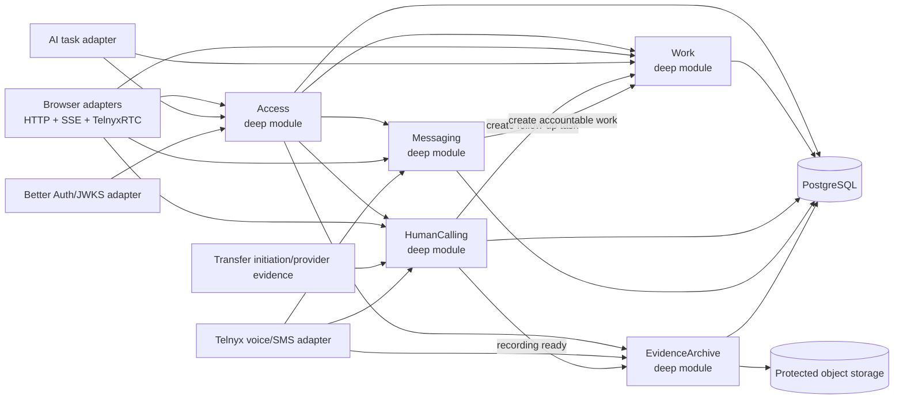
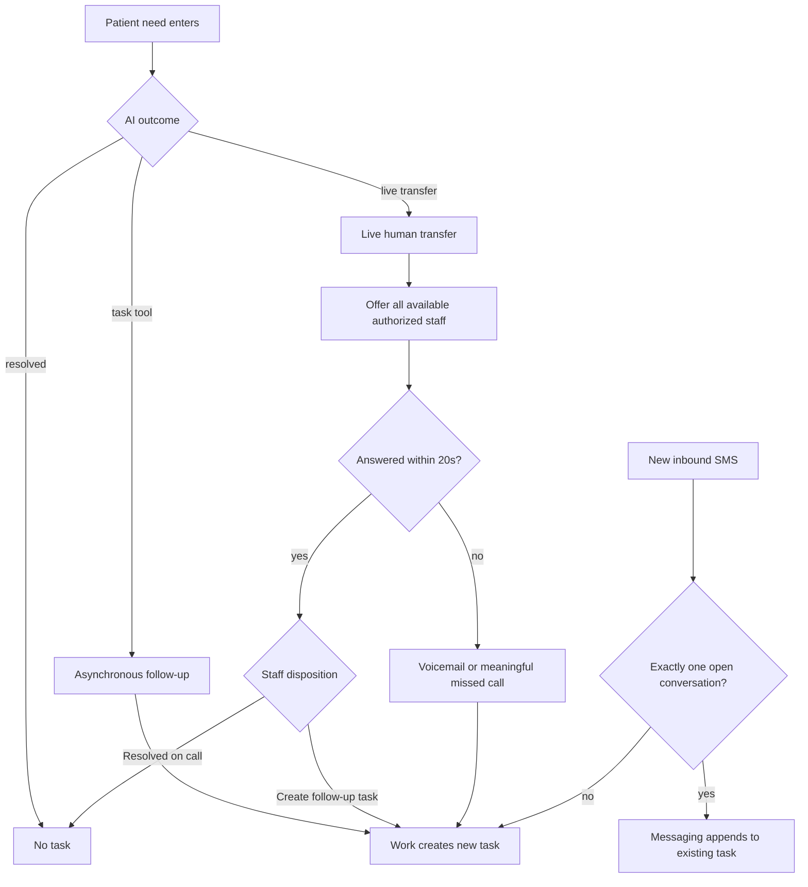
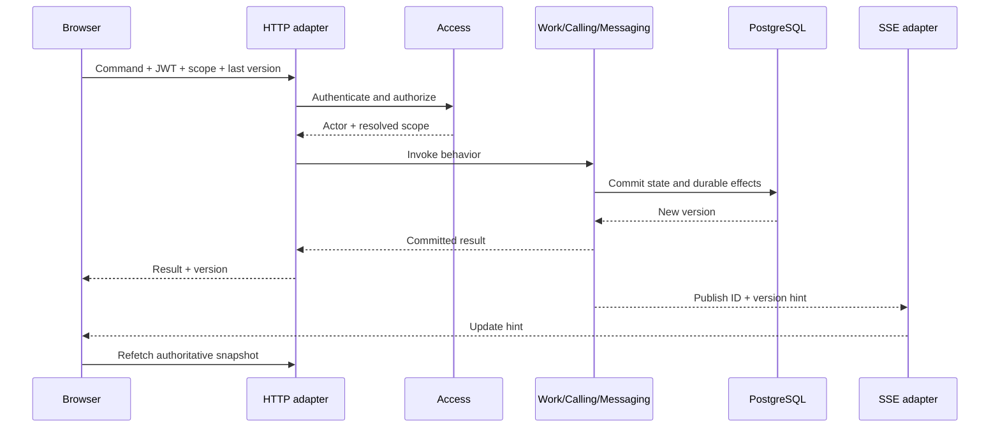
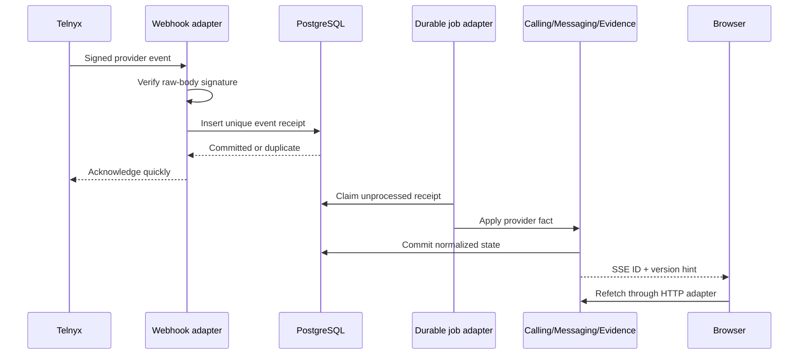

# Architecture

> Target architecture for the August 6, 2026 release. The repository is greenfield; this document defines intended ownership and flow, not code that already exists.

Acuity Portal is a Next.js web application backed by one Go modular monolith and PostgreSQL. Staff commands use HTTP, browser updates use SSE hints, human-call media uses TelnyxRTC/WebRTC, and provider events arrive through signed webhooks.

The [product and technical specification](../acuity-portal-product-technical-spec.md) is the source of truth for product behavior and the release bar.

```text
┌─────────────────────────────────────────────────────────────────────┐
│ Browser — Next.js, React, TypeScript                                │
│                                                                     │
│ Better Auth session     Generated HTTP client     TelnyxRTC client  │
└───────┬────────────────────────┬────────────────────────┬───────────┘
        │ session + JWT          │ HTTPS commands         │ WSS signaling
        │                        │ SSE update hints       │ WebRTC media
┌───────▼───────────────┐  ┌─────▼──────────────────┐  ┌─▼──────────────┐
│ Next.js + Better Auth │  │ Go product runtime     │  │ Telnyx         │
│ sign-in and sessions  │  │                        │  │ voice + SMS     │
│ JWT + JWKS            │  │ Access                 │  └─┬──────────────┘
└───────────────────────┘  │ Work                   │    │ signed webhooks
                           │ HumanCalling           │    │ provider events
┌───────────────────────┐  │ Messaging              │◄───┘
│ Existing AI agent     │─►│ EvidenceArchive        │
│ handoff + task tool   │  │ transport adapters     │
└───────────────────────┘  └───────┬────────┬───────┘
                                   │        │
                         ┌─────────▼──┐  ┌──▼────────────────┐
                         │ PostgreSQL │  │ Protected object  │
                         │ authority  │  │ storage           │
                         └────────────┘  └───────────────────┘
```

## Modules

The Go runtime contains five deep modules. Each module has one behavior-oriented interface; HTTP handlers, SQL, Telnyx, Better Auth/JWKS, SSE, object storage, and durable jobs are adapters around those interfaces.

| Module | Owns | Does not own |
|---|---|---|
| `Access` | Human and service principals, invitations, memberships, roles, location scope, authorization decisions | Better Auth session implementation, task state, provider credentials |
| `Work` | Task creation, assignment, priority, status, completion, reopening, activity, queue projections | Telnyx behavior, call state, message delivery |
| `HumanCalling` | Availability, simultaneous offers, winner election, logical call state, bridge confirmation, post-call disposition, recording readiness | Task lifecycle, SMS correlation, protected evidence access |
| `Messaging` | Inbound correlation, send intent, delivery state, retries | Task lifecycle, contact identity, call state |
| `EvidenceArchive` | Recording/transcript availability, protected grants, access audit, retention, deletion | Call control, task completion, provider routing |

`ContactContext` is a value object shared by tasks and interactions. It contains a normalized phone number when available, optional name, optional AI handoff context, and provenance. It is not a global Contact module or verified patient identity.

## Ownership and dependency direction



Dependency rules:

1. `Access` resolves practice and location scope before protected behavior runs. Client-supplied IDs are requested context, not proof of access.
2. `HumanCalling` and `Messaging` may ask `Work` to create accountable work. `Work` does not know Telnyx.
3. `EvidenceArchive` grants protected access after authorization. No caller receives a permanent recording URL.
4. PostgreSQL is the sole durable product authority. SSE, browser state, and provider commands are projections or requests.
5. Provider events are facts. A browser click cannot prove that a call bridged, an SMS delivered, or a recording became available.

## Seams and adapters

Only dependencies that actually vary get a seam.

| Seam | Production adapter | Test adapter | Why the seam is real |
|---|---|---|---|
| Human identity | Better Auth JWT/JWKS | Signed test JWT/JWKS | Authentication varies without changing `Access` |
| Voice provider | Telnyx voice/webhook adapter | Deterministic provider adapter | Live provider behavior must be simulated and accepted live |
| Messaging provider | Telnyx messaging/webhook adapter | Signed fixture adapter | Delivery, replay, and failure must be deterministic in tests |
| Evidence storage | Protected object-storage adapter | Local test-storage adapter | Access and retention behavior must run without production storage |

PostgreSQL is local-substitutable infrastructure, not an external module interface. Module integration tests use real PostgreSQL behavior so transactions, locking, unique constraints, and optimistic concurrency remain inside the implementation being tested.

The provider seams exist for deterministic testing, not speculative multi-vendor support. Telnyx is the only production voice and messaging provider in this release.

## Task creation paths



An ambiguous or post-completion inbound SMS creates a new unassigned task. An exact match stays on the existing task.

## Staff command lifecycle



SSE never carries authoritative product state. A reconnecting browser refetches the current HTTP snapshot.

## AI-to-human transfer lifecycle

```mermaid
sequenceDiagram
    participant Start as Transfer initiation
    participant Calling as HumanCalling
    participant DB as PostgreSQL
    participant Staff as Available staff browsers
    participant Telnyx
    participant Work

    Start->>Calling: Initiate transfer with ContactContext
    Calling->>DB: Create logical call and 20s offer
    Calling-->>Staff: SSE offer hint
    Staff->>Calling: Concurrent accept attempts
    Calling->>DB: Atomically elect one winner
    Calling-->>Staff: One winner; losers see claimed
    Calling->>Telnyx: Bridge winning staff leg
    Telnyx-->>Calling: Provider-confirmed bridge
    Calling-->>Staff: Populate active engagement workspace
    Telnyx-->>Calling: Provider-confirmed termination
    Calling->>DB: Set NEEDS_DISPOSITION
    alt Resolved on call
        Staff->>Calling: Record resolved disposition
        Calling->>DB: Close disposition without task
    else Follow-up remains
        Staff->>Calling: Create follow-up task
        Calling->>Work: Prefilled task command
        Work->>DB: Create assigned IN_PROGRESS task
    end
```

A live transfer never creates a task before staff disposition. If nobody answers within 20 seconds, Telnyx routes to voicemail; voicemail or a meaningful missed call creates accountable work.

The exact transfer-ingress mechanism is intentionally unspecified until implementation: initiation may arrive through an authenticated AI command, provider evidence, or a combination. `HumanCalling` owns the lifecycle after initiation.

## Provider-event lifecycle



Provider receipts, idempotency receipts, and durable jobs live in PostgreSQL. Replays, reordering, process loss, and retries must converge on one durable outcome.

## Test surface

The highest test seam is:

> External provider/AI event or staff action → authenticated Go command → PostgreSQL transition → visible portal state.

- Tests call the same module interfaces as production adapters.
- Real PostgreSQL tests prove locking, authorization scope, idempotency, versions, and lifecycle transitions.
- Provider adapters supply deterministic replay, reordering, timeout, and failure scenarios.
- Playwright proves the complete browser-visible journey across two authorized sessions.
- Controlled live Telnyx acceptance proves WebRTC, bridge, media, recording, transcription, SMS delivery, and voicemail behavior that simulation cannot prove.

## Invariants

- One task represents one accountable outcome.
- One call offer produces at most one winner.
- One retryable input produces at most one durable result.
- A resolved interaction creates no task.
- An answered transfer remains `NEEDS_DISPOSITION` until staff chooses an outcome.
- Consequential action on an unassigned task claims it before contacting a provider.
- Stale task versions cannot overwrite ownership or issue duplicate contact.
- Phone-number history is context, not verified identity.
- `Access` resolves practice and location scope before every protected module invocation; caller-supplied IDs never grant authority.
- Realtime transport loss cannot lose durable work.
