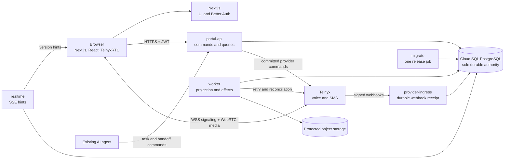
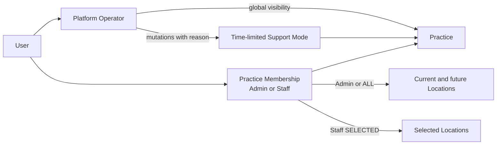
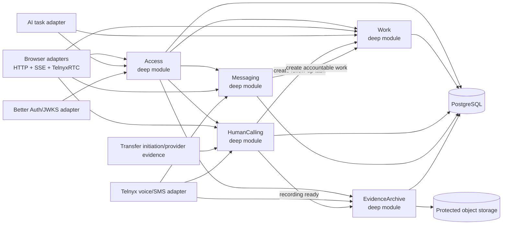
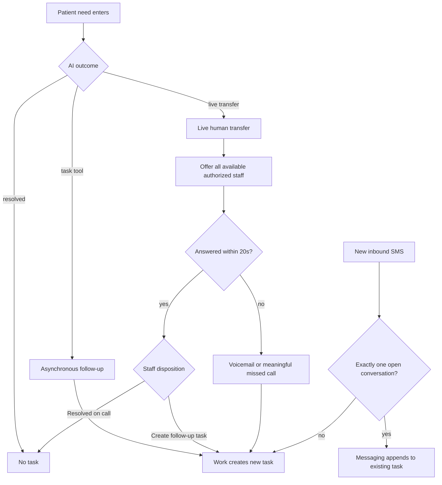
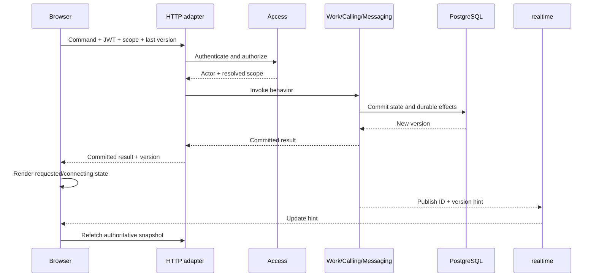
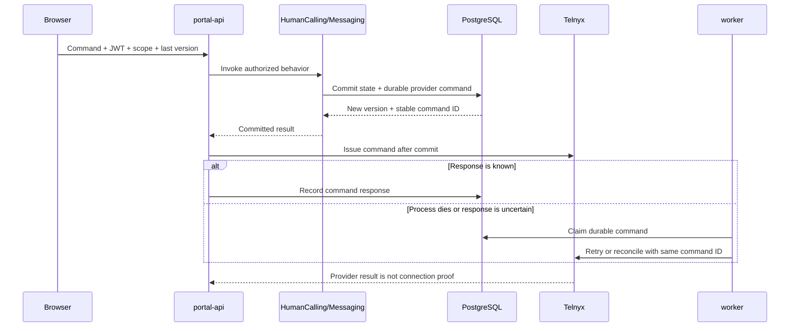
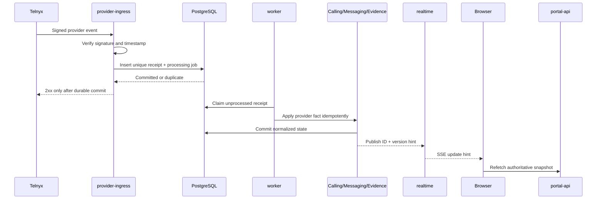

# Architecture

> Target architecture for the August 6, 2026 release. The repository is greenfield; this document defines intended ownership and flow, not code that already exists.

Acuity Portal is a Next.js web application backed by one Go modular monolith and PostgreSQL. The backend has one codebase, binary, image, domain implementation, and database authority, while unlike workloads run in isolated runtime roles. Staff commands use HTTP, browser updates use SSE hints, human-call media uses TelnyxRTC/WebRTC, and provider events arrive through signed webhooks.

The [product and technical specification](../acuity-portal-product-technical-spec.md) is the source of truth for product behavior and the release bar.



## Modules

The Go runtime contains five deep modules. Each module has one behavior-oriented interface; HTTP handlers, SQL, Telnyx, Better Auth/JWKS, SSE, object storage, and durable jobs are adapters around those interfaces.

| Module | Owns | Does not own |
|---|---|---|
| `Access` | Human and service principals, invitations, memberships, Platform Operators, Support Mode, roles, location scope, authorization decisions | Better Auth session implementation, task state, provider credentials |
| `Work` | Task creation, assignment, priority, status, completion, reopening, activity, queue projections | Telnyx behavior, call state, message delivery |
| `HumanCalling` | Availability, simultaneous offers, winner election, logical call state, bridge confirmation, post-call disposition, recording readiness | Task lifecycle, SMS correlation, protected evidence access |
| `Messaging` | Inbound correlation, send intent, delivery state, retries | Task lifecycle, contact identity, call state |
| `EvidenceArchive` | Recording/transcript availability, protected grants, access audit, retention, deletion | Call control, task completion, provider routing |

`ContactContext` is a value object shared by tasks and interactions. It contains a normalized phone number when available, optional name, optional AI handoff context, and provenance. It is not a global Contact module or verified patient identity.

## Access model



- Practice is the customer tenant and security boundary; Location is its physical or operational subdivision.
- Admin always receives dynamic `ALL` scope. Staff receives either dynamic `ALL` scope or explicit `SELECTED` location grants.
- Dynamic `ALL` scope includes locations created after the membership. `SELECTED` scope does not.
- Platform Operator is a distinct Acuity-internal role rather than a replicated Practice membership.
- Platform Operators keep global visibility but operate within an explicit active practice/location. Customer-data mutations additionally require unexpired, practice-scoped Support Mode with a reason and persistent UI indication.
- Authorization records the real human or service actor. Support Mode never impersonates a customer user.
- Human accounts are fresh and invite-only. Better Auth owns verified email/password credentials and recovery; `Access` owns invitations, roles, scopes, and authorization.

## Browser shell

The frontend is a greenfield, desktop-first, sidebar-native operating workspace:

- a persistent left sidebar owns practice/location context, product navigation, search, filters, the current section's dense work list, and user status;
- selection changes the central living workspace without replacing the application shell;
- the task canvas holds the need, next action, communication thread, controls, and persistent composer;
- context opens as a right drawer and may pin only on wide displays; and
- active call state and controls remain mounted across sidebar selection and context navigation.

The visual foundation is Tailwind CSS 4, shadcn/ui Mira with Zinc tokens, Base UI
primitives, Lucide React, CVA, `tailwind-merge`, DM Sans, and a technical
JetBrains Mono/SF Mono fallback. Light mode is the initial default with a
persisted, full-parity near-black dark mode. Semantic CSS variables own
operational state; translucency and grain stay out of task and communication
content.

## Runtime roles

The same Go binary and immutable image run with one explicit mode:

| Role | Cloud Run resource | Responsibility | Failure isolation |
|---|---|---|---|
| `portal-api` | Service | Authenticated commands and queries | Preserves latency for staff and call control |
| `provider-ingress` | Service | Verify and durably receipt provider webhooks | Acknowledgment does not wait for projection or external effects |
| `realtime` | Service | Authorized SSE version hints | Long-lived streams do not occupy command capacity |
| `worker` | Worker pool | Project provider facts and execute durable effects | Retry and reconciliation continue outside request traffic |
| `migrate` | Job | Apply one reviewed forward-compatible product and auth schema migration | Schema change never runs during instance startup |

This is not a microservice split. Runtime roles do not own separate domain state,
schemas, or private domain interfaces. They invoke the same deep modules in
process and coordinate only through committed PostgreSQL state.

Each role has a distinct Google service identity and least-privilege database
role. Only `migrate` can change schema. The other roles receive only the
read/write privileges required by their adapters.

`migrate` applies version-controlled product SQL and reviewed Better Auth schema
SQL. Runtime Go modules do not read or mutate Better Auth-owned tables.

## Ownership and dependency direction



Dependency rules:

1. `Access` resolves Platform Operator or Practice membership, role, dynamic or selected location scope, and Support Mode before protected behavior runs. Client-supplied IDs are requested context, not proof of access.
2. `HumanCalling` and `Messaging` may ask `Work` to create accountable work. `Work` does not know Telnyx.
3. `EvidenceArchive` grants protected access after authorization. No caller receives a permanent recording URL.
4. PostgreSQL is the sole durable product authority. SSE, browser state, and provider commands are projections or requests.
5. Provider events are facts. A browser click cannot prove that a call bridged, an SMS delivered, or a recording became available.

## Seams and adapters

Only dependencies that actually vary get a seam.

| Seam | Production adapter | Test adapter | Why the seam is real |
|---|---|---|---|
| Human identity | Better Auth JWT/JWKS | Signed test JWT/JWKS | Authentication varies without changing `Access` |
| Voice provider | Telnyx voice/webhook adapter | Deterministic provider adapter | Live provider behavior must be simulated and accepted live |
| Messaging provider | Telnyx messaging/webhook adapter | Signed fixture adapter | Delivery, replay, and failure must be deterministic in tests |
| Evidence storage | Protected object-storage adapter | Local test-storage adapter | Access and retention behavior must run without production storage |

PostgreSQL is local-substitutable infrastructure, not an external module interface. Module integration tests use real PostgreSQL behavior so transactions, locking, unique constraints, and optimistic concurrency remain inside the implementation being tested.

The provider seams exist for deterministic testing, not speculative multi-vendor support. Telnyx is the only production voice and messaging provider in this release.

## Connection and concurrency budget

Every Cloud Run instance owns a local connection pool. The production ceiling is:

```text
sum(each service's maximum instances × its pool maximum)
  + fixed worker connections
  + Next.js and Better Auth connections
  + dedicated LISTEN connections
  + migration and operator headroom
```

Rules:

1. Each runtime role has explicit concurrency, minimum-instance, maximum-instance, and `pgxpool` limits.
2. Normal maximum pools leave capacity for overlapping revisions, failover reconnects, migrations, autovacuum, and operator access.
3. `realtime` uses one dedicated direct connection per instance for `LISTEN/NOTIFY`; notifications are hints and durable rows repair every gap.
4. Transactions are short. Shared rows are locked in deterministic order, and serialization failures or deadlocks retry the complete bounded transaction.
5. No provider request runs while a PostgreSQL transaction is open.
6. Cloud SQL failover is treated as a visible transient outage. Connections use bounded acquisition and jittered backoff; only safe idempotent operations retry.

Before sizing these limits, record the 12-month capacity envelope: peak
concurrent staff, active calls, open SSE streams, command rate, webhook burst
rate, daily messages, PostgreSQL data volume, and evidence-retention volume.
Load and failure gates exercise the approved peak and burst factor.

## Task creation paths



An ambiguous or post-completion inbound SMS creates a new unassigned task. An exact match stays on the existing task.

## Staff command lifecycle



SSE never carries authoritative product state. A reconnecting browser refetches the current HTTP snapshot.

## Provider-command lifecycle



The database/provider gap is explicit. PostgreSQL commits ownership and intent
before the external effect. The low-latency path issues the effect immediately,
while the durable worker repairs interruption. Provider events, not the command
response or browser intent, prove bridge, delivery, recording, and termination.

## AI-to-human transfer lifecycle

```mermaid
sequenceDiagram
    participant Start as Transfer initiation
    participant Calling as HumanCalling
    participant DB as PostgreSQL
    participant Staff as Available staff browsers
    participant Telnyx
    participant Work

    Start->>Calling: Initiate transfer with ContactContext
    Calling->>DB: Create logical call and 20s offer
    Calling-->>Staff: SSE offer hint
    Staff->>Calling: Concurrent accept attempts
    Calling->>DB: Atomically elect one winner
    Calling-->>Staff: One winner; losers see claimed
    Calling->>Telnyx: Bridge winning staff leg
    Telnyx-->>Calling: Provider-confirmed bridge
    Calling-->>Staff: Populate active engagement workspace
    Telnyx-->>Calling: Provider-confirmed termination
    Calling->>DB: Set NEEDS_DISPOSITION
    alt Resolved on call
        Staff->>Calling: Record resolved disposition
        Calling->>DB: Close disposition without task
    else Follow-up remains
        Staff->>Calling: Create follow-up task
        Calling->>Work: Prefilled task command
        Work->>DB: Create assigned IN_PROGRESS task
    end
```

A live transfer never creates a task before staff disposition. If nobody answers within 20 seconds, Telnyx routes to voicemail; voicemail or a meaningful missed call creates accountable work.

The exact transfer-ingress mechanism is intentionally unspecified until implementation: initiation may arrive through an authenticated AI command, provider evidence, or a combination. `HumanCalling` owns the lifecycle after initiation.

## Provider-event lifecycle



Provider receipts, idempotency receipts, and durable jobs live in PostgreSQL. Replays, reordering, process loss, and retries must converge on one durable outcome.

## Realtime lifecycle

- `realtime` authorizes the stream and sends stable IDs plus monotonically increasing versions.
- Streams have a bounded lifetime, heartbeats, and jittered reconnect.
- Initial connection and every reconnect fetch the current authorized snapshot through `portal-api`.
- `LISTEN/NOTIFY` only wakes instances; missed or folded notifications cannot lose durable state.
- Realtime failure degrades freshness, not correctness. The browser refetches and may use bounded polling until the stream returns.

## Deployment lifecycle

1. Build one immutable backend image and one immutable frontend image.
2. Run integration, concurrency, replay, and browser tests against the exact backend digest.
3. Deploy backend request-role revisions with no traffic and smoke-test startup and dependencies.
4. Run `migrate` once using expand/contract-compatible SQL.
5. Exercise the tagged request revisions against the expanded schema, then deploy compatible `worker` and `realtime` revisions from the same backend digest.
6. Shift traffic gradually while monitoring revision-specific latency, pool use, webhook acknowledgment, and job depth.
7. Deploy the frontend after its backend contract is live.
8. Roll back traffic without reversing the database. Contract old columns or behavior only in a later release.

Every role handles termination, but correctness depends on committed rows and
leases rather than shutdown cleanup.

## Test surface

The highest test seam is:

> External provider/AI event or staff action → authenticated Go command → PostgreSQL transition → visible portal state.

- Tests call the same module interfaces as production adapters.
- Real PostgreSQL tests prove locking, authorization scope, idempotency, versions, and lifecycle transitions.
- Provider adapters supply deterministic replay, reordering, timeout, and failure scenarios.
- Playwright proves the complete browser-visible journey across two authorized sessions.
- Controlled live Telnyx acceptance proves WebRTC, bridge, media, recording, transcription, SMS delivery, and voicemail behavior that simulation cannot prove.
- Failure acceptance kills runtime roles between database commit and external effect, exercises Cloud SQL failover, overlaps revisions, and verifies the calculated connection ceiling.

## Invariants

- One task represents one accountable outcome.
- One call offer produces at most one winner.
- One retryable input produces at most one durable result.
- A resolved interaction creates no task.
- An answered transfer remains `NEEDS_DISPOSITION` until staff chooses an outcome.
- Consequential action on an unassigned task claims it before contacting a provider.
- Stale task versions cannot overwrite ownership or issue duplicate contact.
- Phone-number history is context, not verified identity.
- `Access` resolves practice and location scope before every protected module invocation; caller-supplied IDs never grant authority.
- Admin and `ALL`-scope Staff automatically receive current and future Practice locations; `SELECTED`-scope Staff receive only explicit grants.
- Platform Operator visibility never implies mutation authority; customer-data changes require an active, audited, practice-scoped Support Mode without impersonation.
- Public sign-up is disabled; accepting an invitation never requires an operator to create or know another user's password.
- Realtime transport loss cannot lose durable work.
- A provider webhook receives `2xx` only after its unique durable receipt commits.
- A provider request never runs while a PostgreSQL transaction is open.
- One durable provider command survives process death and converges without duplicate effect.
- No runtime role or overlapping deployment can exceed the planned PostgreSQL connection ceiling.
- Old and new revisions remain schema-compatible throughout rollout and rollback.
- Runtime, realtime, provider, or database interruption is visible and recoverable; it never creates false success.

The supporting rationale and primary sources are in
[Backend concurrency and resilience review](../research/backend-concurrency-resilience-review.md).
