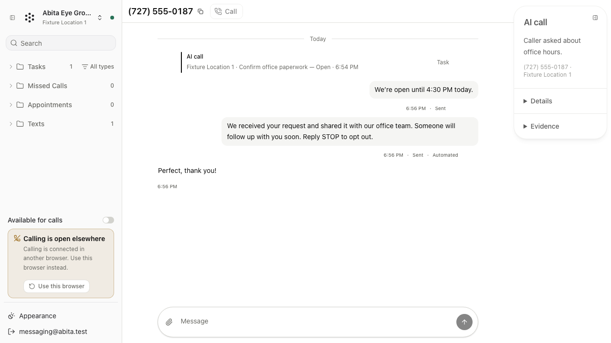

# Shared call history verification

An AI call, its staff transfer, and its linked Tasks appear in one brief
history entry using the existing Activity styling. The call and linked-work
buttons open the existing side panels directly. Task completion and reopening
remain later chronological Activity. Task creation, merging, completion rules,
and provider behavior are unchanged.

Workspace groups authorized evidence before pagination using source Call IDs,
Call IDs, and explicit Task attachments within a Location. Phone similarity
alone does not establish a link. Stable display IDs survive late AI closeout.
A repeatable-read transaction keeps page membership and evidence consistent.
The browser replaces overlapping history items by their stable identity.

The phone, opened Call, and opened Task history endpoints support
`groupCalls=true`. The web opts in; existing clients retain their flat response
and cursor behavior during independent web/backend rollouts. No migration is
required. An older backend can still return flat history to the new web during
rollout; grouping becomes available when the new backend serves the request.

## Before and after

A disposable PostgreSQL regression initially returned a Task-only page with a
continuation cursor for AI + transfer + Task at `limit=1`. It now returns one
complete `CALL_HISTORY` item containing all three records and no continuation.
Further checks cover separate calls sharing a number, late closeout, older-page
cursors, restricted Locations, later Task completion, the legacy flat response,
and one recovery Task linked from multiple missed-call/voicemail histories.

Frontend checks exercise one compact entry containing booking, voicemail,
and Task status, with direct access to all three existing detail panels.
Transfer intent without staff evidence retains an unknown outcome.

## Local verification

Commands ran from the isolated worktree, using `corepack pnpm@10.34.5` for the
repository's pinned package manager. All database data and screenshots are
synthetic.

| Check | Result |
| --- | --- |
| `TEST_DATABASE_URL=... go test -p 1 ./backend/... ./deploy -count=1` | Passed in full against disposable `acuity_call_history_test` |
| `go generate ./backend/internal/api && pnpm --dir web api:generate` | Generated Go/browser files reproduced exactly |
| `pnpm --dir web lint` | Passed |
| `pnpm --dir web typecheck` | Passed |
| `pnpm --dir web test:unit` | 238 library and 16 render tests passed |
| `pnpm --dir web build` | Passed, including standalone packaging |
| Full browser suite for backend grouping | 29 Chromium journeys passed |
| Final brief presentation: `E2E_DATABASE_URL=... ./scripts/run-e2e.sh messaging-workspace.spec.ts human-calling.spec.ts` | All 8 affected Chromium journeys passed in 1.6 minutes |
| `git diff --check` | Passed |

The final browser run verified one brief AI call entry, direct opening of the
existing side popup, the linked Task action, and chronological completion.
The full 29-journey run preceded the final presentation correction; the eight
affected journeys were rerun afterward. Backend behavior did not change in
that presentation correction.

Occupied local ports required temporary copies of the browser runner and its
Telnyx fixture with only port substitutions: web 13438, API 18438, realtime
18439, ingress 18440, and fixture 19438. PostgreSQL used port 55438 and the
explicitly disposable `acuity_call_history_e2e` database. The actual final
invocation used `sh scripts/.call-history-e2e.sh` with the two spec arguments
above. The temporary copies were removed and the database server stopped.

## Evidence boundary

This proves local application, PostgreSQL, and browser behavior with a
controlled Telnyx fixture. Hosted CI, deployment, production duplicate-Task
counts, and live provider calls are separate evidence. No deployment or
production data mutation is part of this change.
